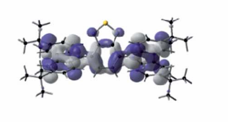

<div align="center">

# VMD + Multiwfn 绘图工作台

面向 Windows 的 VMD 绘图与 Multiwfn 批处理桌面工具

[](https://github.com/super3-moon/new_v/releases/latest)


[下载最新版](https://github.com/super3-moon/new_v/releases/latest) · [功能](#功能) · [源码运行](#源码运行) · [构建与测试](#构建与测试)



</div>

这是一套把 Multiwfn 数据处理、VMD 等值面绘图和批量任务整合到同一界面的桌面工作台。你可以直接选择内置风格完成绘图，也可以导出可重复运行的脚本，或记录一次 Multiwfn 操作并应用到整批文件。

## 功能

- **直接绘图**：拖入单个文件；Cube 文件直接交给 VMD，其他格式先由 Multiwfn 处理。
- **风格管理**：提供套装与骨架/等值面拆分模式，支持搜索、材质筛选、排序和参数调整。
- **自定义风格**：可从 VMD Save State 导入，也可使用 OpenAI 或 Gemini 辅助识别参考图风格。
- **批量 Multiwfn**：录制或导入命令序列，预检后批量执行，并汇总日志、结果和 CSV。
- **结果保护**：任务使用独立工作目录，避免固定文件名互相覆盖；渲染结果可保存到输入目录或指定目录。
- **桌面体验**：支持深浅主题、响应式布局和常用快捷键。

## 快速开始

1. 从 [Releases](https://github.com/super3-moon/new_v/releases/latest) 下载最新版 `VMD_Multiwfn_StyleGenerator.exe`。
2. 从 [Multiwfn 官网](http://sobereva.com/multiwfn/) 和 [VMD 官网](https://www.ks.uiuc.edu/Research/vmd/) 下载并安装程序，准备好 `Multiwfn.exe` 与 `vmd.exe`。
3. 启动程序，在左侧设置或自动扫描软件路径。
4. 选择绘图风格，然后使用“直接绘图”“导出脚本”或“批量 Multiwfn”。

> [!IMPORTANT]
> 仓库和发行版不包含 Multiwfn、VMD 及其授权文件，请从对应官方渠道单独安装。

> [!NOTE]
> OpenAI / Gemini 仅用于可选的图片风格识别。其他绘图、脚本生成和批处理功能不需要 API Key。

## 源码运行

### 环境要求

- Windows 10 或 Windows 11
- Python 3.12+
- Multiwfn
- VMD

```powershell
git clone https://github.com/super3-moon/new_v.git
cd new_v

python -m venv .venv
.\.venv\Scripts\Activate.ps1
python -m pip install -r .\requirements.txt
python .\vmd_style_tool_qt6.py
```

程序会在首次运行时生成本机路径配置和用户自定义风格数据；这些文件不会提交到 Git。

## 使用概览

### 直接绘图

1. 在套装模式中选择完整风格，或分别选择骨架与等值面风格。
2. 点击“直接绘图”，拖入一个本地文件。
3. 设置等值面数值与结果目录。
4. Cube 文件会直接打开 VMD；其他文件会先打开 Multiwfn，完成交互并正常退出后继续进入 VMD。

### 批量处理

1. 添加输入文件或扫描文件夹。
2. 选择内置流程，或录制、粘贴、导入自己的 Multiwfn 命令序列。
3. 配置输出类型并运行“预检 / 预览”。
4. 试运行通过后执行完整批次，在结果目录查看 `manifest.json`、`summary.csv`、日志和归档结果。

### 快捷键

| 快捷键 | 操作 |
| --- | --- |
| `Ctrl+F` | 聚焦风格搜索 |
| `Ctrl+Enter` | 使用当前风格直接绘图 |
| `Ctrl+G` | 导出脚本 |
| `Ctrl+T` | 切换深浅主题 |

## 项目结构

```text
vmd_style_tool_qt6.py          # PySide6 桌面入口
vmd_style_tool.py              # 风格、VMD Tcl 与脚本生成核心
direct_workflow_qt6.py         # 直接绘图流程
multiwfn_batch.py              # 批处理规划与执行核心
multiwfn_batch_qt6.py          # 批处理工作台界面
multiwfn_recorder_qt6.py       # Multiwfn 操作录制
style_parameter_dialog_qt6.py  # 风格参数查看与编辑
vmd_cube_styles/               # 内置风格图片与 VMD 资源
tests/                         # 自动化测试
```

## 构建与测试

运行快速自检：

```powershell
python .\vmd_style_tool_qt6.py --self-test
```

运行完整测试：

```powershell
python -m unittest discover -s tests -v
```

构建 Windows 可执行文件：

```powershell
python -m pip install -r .\requirements-build.txt
powershell -ExecutionPolicy Bypass -File .\build_release.ps1
```

构建结果会写入本地 `release\YYYY-MM-DD[_vN]\`。二进制文件不进入源码分支，只通过 GitHub Releases 发布。
